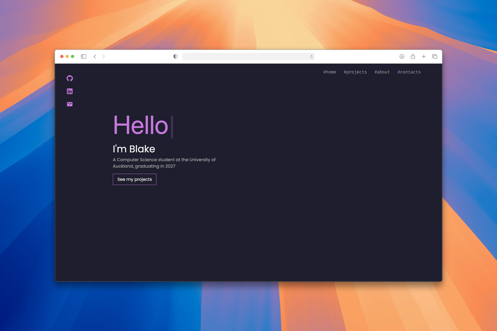

# Blake Simpson Portfolio

A personal portfolio website built with **React** and **Tailwind CSS** to showcase my projects, skills, and contact information. Designed to be responsive and modern, with a clean UI and smooth interactions.

---

## 🚀 Features

- **Responsive Design** – Works on desktop and mobile devices.  
- **Navigation** – Smooth scroll to sections with a mobile-friendly menu.  
- **Hero Section** – Typewriter effect greeting visitors.  
- **Projects Section** – Project cards with tech stack badges and links.  
- **Skills Section** – Skill tags with a clean, wrapped layout.  
- **About Section** – Brief personal and educational info.  
- **Contact Section** – Social icons for GitHub, LinkedIn, and email.  
- **Interactive UI** – Hover effects, color changes, and solid overlay on mobile menu.

---

## 📂 Project Structure
